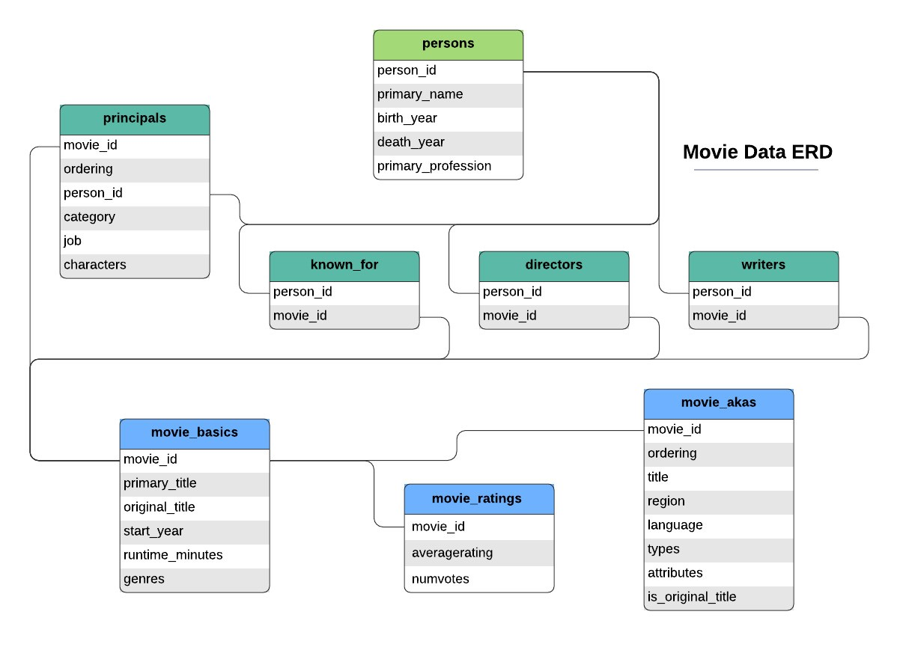

# Microsoft-Movie-Studio-Exploration-And-Data-Analysis

TO GET TO VIEW THE NON-TECHNICAL SLIDES JUST CLICK THE LINK BELOW:
https://www.canva.com/design/DAF2kccMX3I/-4vOQj2a3Wmzd5BVHzSoTg/edit?utm_content=DAF2kccMX3I&utm_campaign=designshare&utm_medium=link2&utm_source=sharebutton
### a) Introduction 
Microsoft is venturing into the entertainment industry by establishing a new movie studio to create original video content. The company recognizes the success of big players in the industry and aims to capitalize on this trend. However, lacking experience in movie production, Microsoft needs insights into the current landscape of successful films at the box office. The goal is to inform strategic decisions regarding the types of films that will resonate well with audiences and maximize profitability.

### b) Problem Statement
Microsoft wants to succeed in the entertainment sector by navigating the complexities of the movie studio business by launching a new venture that will produce original video content that will appeal to viewers and yield maximum profit. Microsoft understands the necessity to learn about the present world of box office-performing films, as it has no past expertise in film creation. The strategic decisions the studio needs to make about the kinds of movies it should make to attract viewers and survive in the cutthroat industry depend heavily on this information.

### c) Main Objective
To empower Microsoft's new movie studio with actionable insights into the dynamics of the film industry, particularly focusing on box office performance by leveraging data analysis and exploration techniques using pandas, where the goal is to identify the key factors contributing to the success of movies, including genres, talented writers, directors, and popularity metrics.
### d) Specific Objectives

1. To explore Box Office Performance by analysing historical data on movies, focusing on key metrics such as total gross, average rating, and number of votes to understand box office performance.

2. Translate insights into recommendations by Providing actionable recommendations for Microsoft's movie studio, suggesting specific genres, writers, directors, and popularity metrics to consider for future movie productions.

3. Position for success by strategically positioning the new movie studio to create content that not only achieves financial success but also resonates with a diverse audience, fostering long-term growth and success in the entertainment market. 

### e) Notebook Structure
1. Data Collection
2. Read and check the data
3. Cleaning the data
4. Exploratory Data Analysis
5. Conclusions and Recommendations

### f) Data Understanding 
The data used in this project are data collected from:
1. https://www.boxofficemojo.com/
2. https://www.imdb.com/
3. https://www.rottentomatoes.com/
4. https://www.themoviedb.org/
5. https://www.the-numbers.com/

The imdb dataset contained 8 tables:
|No.| Table    |
|---| ---       |
|1|movie_basics|
|2|directors|
|3|known_for|
|4|movie_akas|
|5|movie_ratings|
|6|persons|
|7|principals|
|8|writers|

The internal structure is as shown below:

## Methodology
### 1. Data Collection:
   - The project initiated by acquiring the datasets from reputable sources, ensuring a solid foundation for subsequent analyses. The emphasis was placed on securing a comprehensive and accurate dataset to yield meaningful insights throughout the project's lifecycle.

### 2. Read and Check the Data:
   - The datasets were efficiently loaded into the notebook, and the initial assessment was performed meticulously. The project explored the datasets' structure and format through the examination of its initial rows. Rigorous checks for missing values and evaluations of data types were executed to guarantee consistency.

### 3. Cleaning the Data:
   - The project executed a systematic cleaning process to refine the datasets' quality. Addressing missing values, eliminating duplicates, and resolving any inconsistencies were part of the initiative. The dataset was transformed into a polished state, ensuring data integrity and reliability for downstream analyses.

### 4. Exploratory Data Analysis (EDA):
   - In-depth exploration of the dataset was conducted using statistical measures, visualizations, and aggregation techniques. The project identified patterns, correlations, and trends within the movie data. The analysis focused on genres, writers, and directors, providing actionable insights for strategic decision-making.

### 5. Conclusions and Recommendations:
   - The project summarized its findings from the exploratory analysis, offering a comprehensive overview of successful genres, prominent writers, and influential directors within the movie industry. Recommendations were formulated based on these insights, aligning with the project's objectives. Key considerations and potential growth areas for Microsoft's new movie studio were addressed, concluding the notebook with actionable insights to guide strategic decisions in movie production.

    
#### 5a. Conclusions
1.	The most watched/streamed genre is comedy in terms of occurrence but a combination of Adventure, Drama and Sci-Fi does very well in terms of popularity and gross

2.	There is a positive correlation between runtime and reap gross, therefore an increase in runtime gives an increase in gross income, however most of the runtimes fall between the 90 and 150 minute

3.	The highest ranked writers Jack Kirby who writes Action, Adventure, Sci-Fi in terms of gross, while Richard Heap, an Adventure writer is the highest ranked in terms of average rating.

4.	In terms of movie popularity Christopher Nolan tops the list of Directors. However Dean Deblois tops the list when it comes to the number of movies each have directed by a whopping 76 movies ahead of Christopher Nolan who has only directed 22 movies.

5.	There is a positive correlation between Domestic and Foreign Gross. An increase in domestic gross also replicates in an increase in Foreign gross.

#### 5b. Recommendations
    
1.	The company should invest in Comedy, a little more emphasis in Adventure, Drama and Sci-Fi combinations.

2.	The company should invest in movies runtime, with an optimum of 90 to 150 minutes.

3.	The company should look forward to working with top writers in the various fields. They should work more with Jack Kirby when producing Action, Adventure and Sci-Fi movie combination.

4.	The company should work closely with director Christopher Nolan as he is more popular even though he has few movies compared to his counterparts, but however Dean Deblois, is a director the company should incorporate as he has better effort in directing with a whopping 76 directed movies.

5.	The company should invest in movies that do well both in terms domestic n=and foreign gross.
